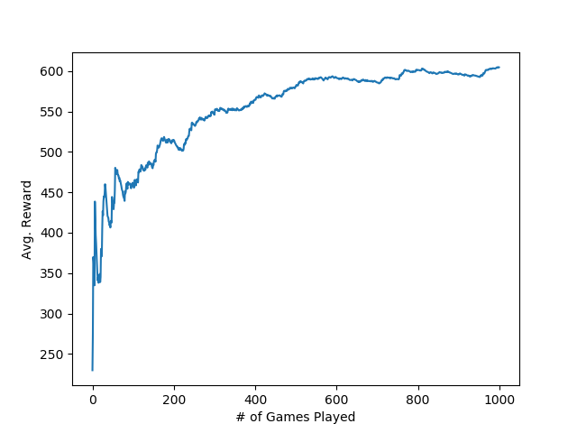
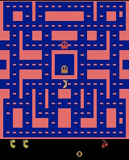

# N-step-Dueling-DDQN-PER-Pacman
> Using N-step dueling DDQN with PER for learning how to play a Pacman game

## Summary

This code will detect faces with the help of haar cascade, then send these faces to a CNN to classify their emotions in real-time. Emotions are surprised, happy, sad, angry, natural, fear, disgust with accuracy of 62.08%.

## Demo

## Preprocessing

  - Capturing front camera frames through a separate thread to speed up the online process.
  - First, the original image is downsized to half for face detection, then increased back to real size.
  - The face is sent through the CNN each 3 frame.

## DQN

## Double DQN

## N-Step Return

## Dueling Network

## Prioritized Experience Replay

## Related Papers

01. [V. Mnih et al., "Human-level control through deep reinforcement learning." Nature, 518
(7540):529–533, 2015.](https://storage.googleapis.com/deepmind-media/dqn/DQNNaturePaper.pdf)
02. [van Hasselt et al., "Deep Reinforcement Learning with Double Q-learning." arXiv preprint arXiv:1509.06461, 2015.](https://arxiv.org/pdf/1509.06461.pdf)
03. [T. Schaul et al., "Prioritized Experience Replay." arXiv preprint arXiv:1511.05952, 2015.](https://arxiv.org/pdf/1511.05952.pdf)
04. [Z. Wang et al., "Dueling Network Architectures for Deep Reinforcement Learning." arXiv preprint arXiv:1511.06581, 2015.](https://arxiv.org/pdf/1511.06581.pdf)
05. [R. S. Sutton, "Learning to predict by the methods of temporal differences." Machine learning, 3(1):9–44, 1988.](http://incompleteideas.net/papers/sutton-88-with-erratum.pdf)

## Author

  - Soheil Changizi ( [@cocolico14](https://github.com/cocolico14) )

## License

This project is licensed under the MIT License - see the [LICENSE](./LICENSE) file for details

